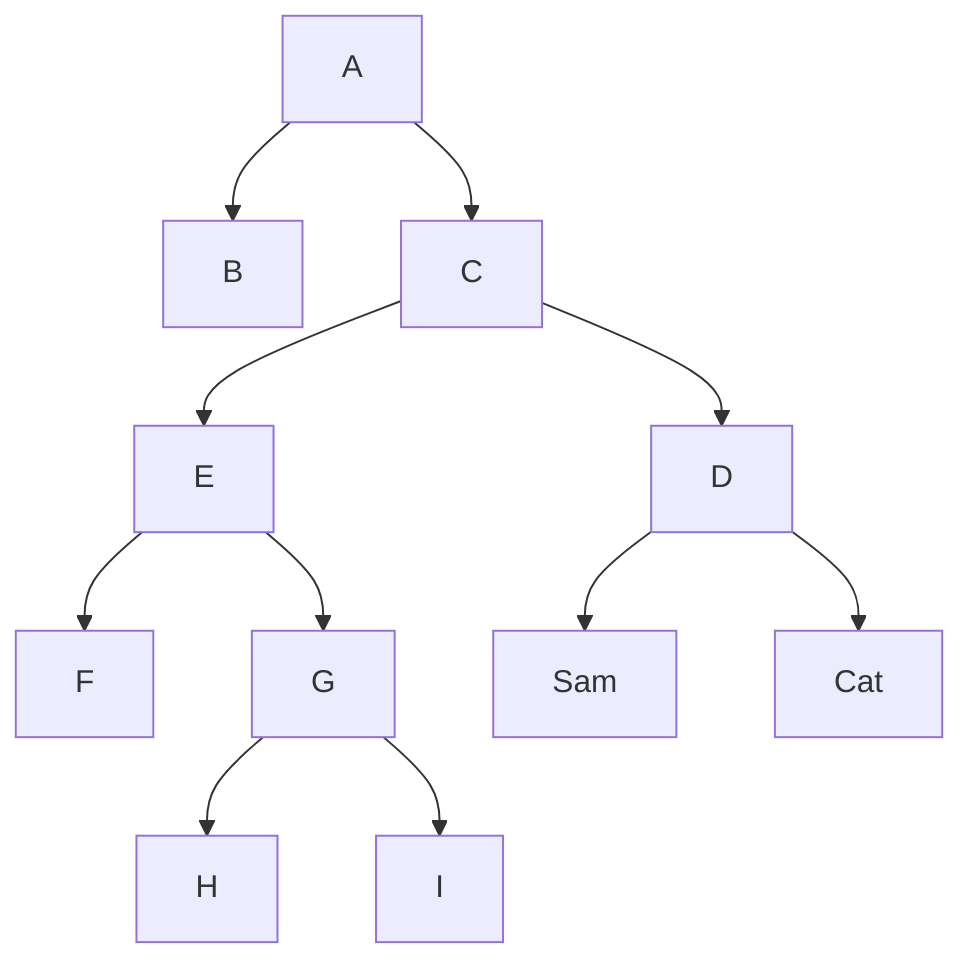

This code tries to copy a data from one tree to another via multithreading which aid improve performance. The transfer of data is executed from bottom to top.

```mermaid
graph TD
  A --> B
  A --> C
  C --> D
  C --> E
  E --> F
  E --> G
  G --> H
  G --> I
  D --> Sam
  D --> Cat
```
