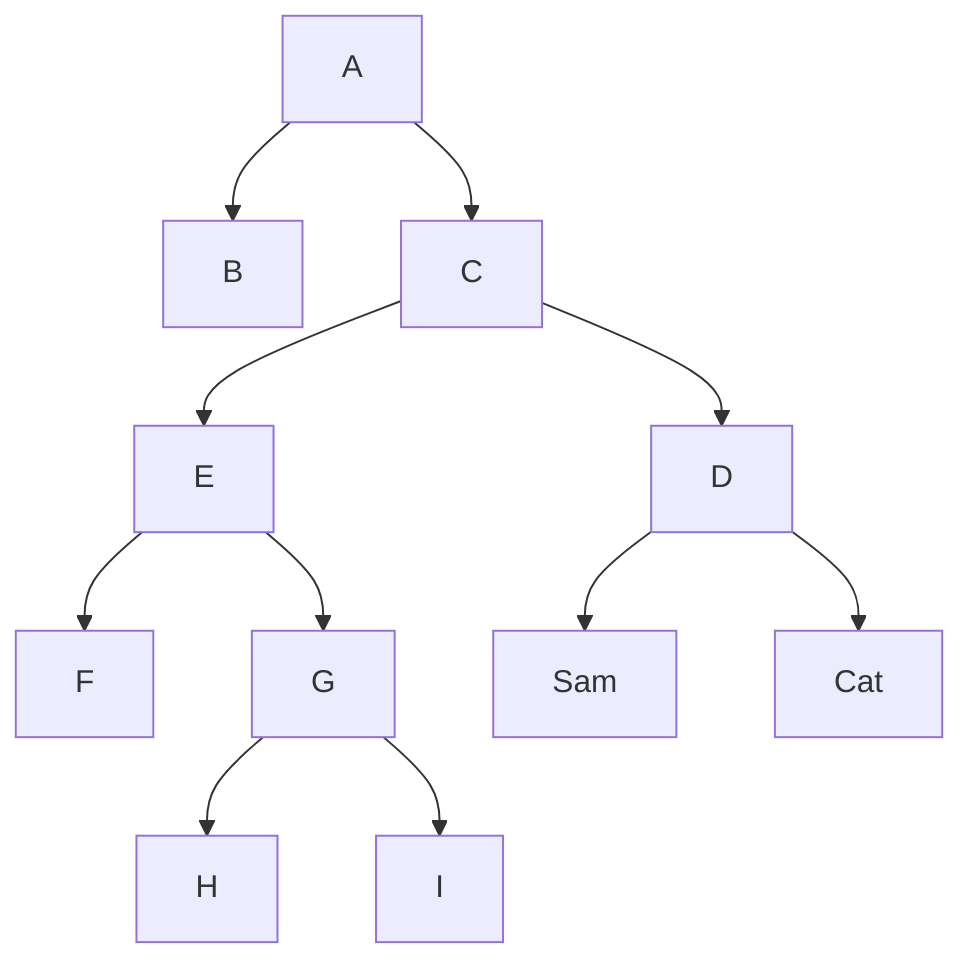

This piece of code attempts to utilize multithreading to enhance performance when copying data from one tree to another. The data transfer is executed in a bottom-to-top traversal manner.

```mermaid
graph TD
  A --> B
  A --> C
  C --> D
  C --> E
  E --> F
  E --> G
  G --> H
  G --> I
  D --> Sam
  D --> Cat
```
